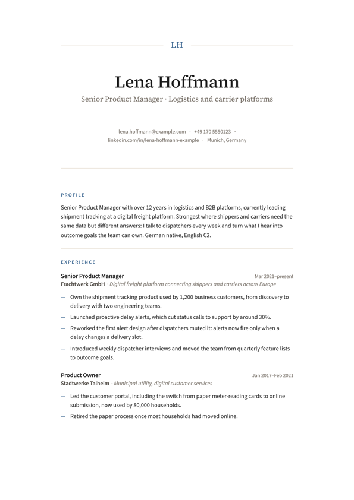
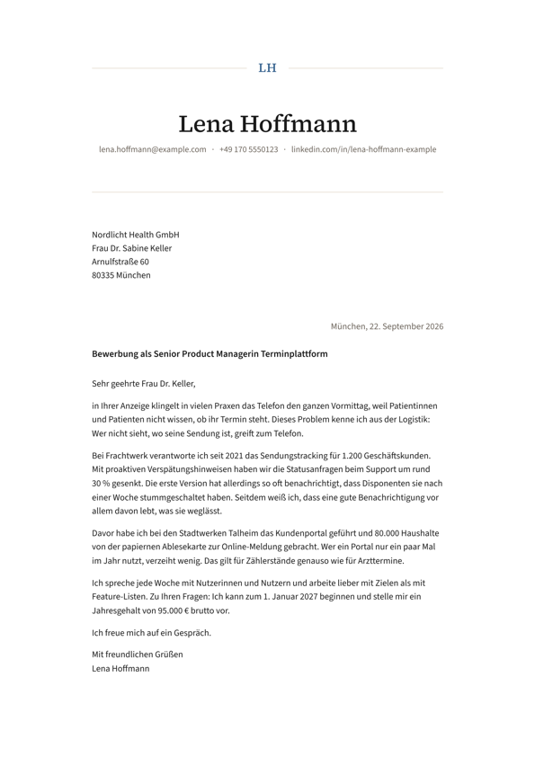

# Apply Kit for Claude

Paste a job ad, get a tailored CV and cover letter as print-ready PDFs. Written from your real
experience, in your own voice, and never with a number you haven't confirmed.

Runs in **Claude Code**, inside the Claude desktop app. Free and open source (MIT).

  
  &nbsp;
  

*Example documents for a fictional applicant, made with this kit. The PDFs are in
`examples/output/`.*

## Why it exists

I built it for my own job search: 89 applications between February and June 2026, 65 of them
with a tailored CV, 42 rejections, 7 interviews, and the job I wanted. Somewhere along the way
my own CVs started contradicting each other, so the whole process is built around one rule:
nothing goes into an application unless you've confirmed it.

## What it does

1. **Sets up once, in about 15 minutes.** Claude reads your old CV and LinkedIn profile, lays
   your career out as one timeline and asks about anything that doesn't add up between them.
   You finish with your first CV as a PDF.
2. **Checks every job ad honestly.** What matches, what's missing, and whether the role sits
   below or above what you're aiming for. Including "this one isn't worth your time".
3. **Writes the CV and cover letter for that job,** in English or German, from your confirmed
   facts only. Before any PDF is made, a script checks every number in the documents against
   your profile, including numbers written as words.
4. **Makes real PDFs:** selectable text that application systems can read, letters fitted to
   one page, page breaks between roles, never in the middle of one.

## What you need

- The **Claude desktop app** and a paid Claude plan that includes Claude Code
- **Node.js**, free, for making the PDFs
- Your current CV as a PDF. A LinkedIn profile saved as PDF helps too. Expand every
  "see more" on LinkedIn before you save it, otherwise the export cuts your roles off.

Tested on macOS. Claude Code and Node.js both run on Windows, so it should work there too.

## Setup, about 5 minutes

1. **Install Node.js.** Go to nodejs.org, download the version marked **LTS**, and install it
   like any other program. If the Claude app is open, quit and reopen it afterwards.
2. **Get the kit.** On GitHub, click **Code**, then **Download ZIP**, and unzip it somewhere
   you'll find it again, for example in Documents. Or `git clone` it.
3. **Open it in Claude Code.** In the Claude desktop app, switch to **Code**, choose to open a
   folder, and select the kit's folder. If Claude asks whether you trust the folder, say yes.
4. **Type "hi".** Claude takes it from there.

## Then, for every job

Paste the ad, or a link to it. Claude tells you how well it fits. If you go ahead, it writes a
CV and a cover letter for that job, checks every number, and makes the PDFs.

**Optional, when you have 20 minutes:** say "deepen my profile". A short interview about your
roles gives your letters real stories, and noticeably better ones.

## Layouts

The kit comes with the **Classic** layout: serif name, centred header, dates on the right.

**[Layout Pack 1](https://buy.polar.sh/polar_cl_NmROLmRsVNrLNKKkFgJAEBsBnHEwqMfQgLxwi3gB17Y)** adds eight more, for 19 € or $19:

- **Modern**, **Compact** and **Margin**: one column, for careers that need two pages.
- **DIN 5008**: the formal German business letter, with the address placed for a window
  envelope, and a tabular CV to match.
- **Statement**, **Mono**, **Sidebar** and **Poster**: two columns on one page, each with an
  optional photo.

Layouts can be mixed: a DIN 5008 letter next to a CV in another layout, for example.

## Your data

Everything you add stays in this folder on your computer. The kit has no account, no server
and no cloud storage. The only place your information goes is to Claude, during your
conversation, under your Claude plan's terms. Your profile, applications and PDFs are
excluded in `.gitignore`, so they stay out of version control if you fork the kit.

## What's in the folder

- `profile/`: your facts. Claude builds and updates these with you.
- `applications/`: your CVs, letters and the job ads, plus a log of every application.
- `output/`: your finished PDFs.
- `examples/`: a fictional person's complete set, to see what the kit produces.
- `themes/`: installed layouts besides Classic.
- `renderer/`, `guide/`, `.claude/`: the kit itself.

## If something doesn't work

- **Claude says Node.js is missing,** though you installed it: quit and reopen the Claude app.
- **The first PDF takes a while:** the kit downloads its PDF engine once, about 100 MB.
- **A job link won't load:** many job sites need a login. Copy the ad's text and paste it in.

Bugs and ideas: open an issue on GitHub.

## Kurz auf Deutsch

1. Node.js (Version **LTS**) von nodejs.org installieren, danach die Claude-App neu starten.
2. Das Kit herunterladen (auf GitHub: **Code**, dann **Download ZIP**) und z. B. unter
   Dokumente entpacken.
3. In der Claude-App auf **Code** wechseln und den Ordner öffnen.
4. „Hallo“ schreiben. Claude führt durch die Einrichtung, auf Deutsch, wenn Sie Deutsch schreiben.

Danach: Stellenanzeige einfügen, Claude prüft, wie gut sie passt, und schreibt Lebenslauf und
Anschreiben als PDF. Das **[Layout Pack 1](https://buy.polar.sh/polar_cl_oy5ZBeS71ub3jzTs6Hfl86JcHbQhbn0Wo7OZn4QHc1s)** (19 €)
bringt acht weitere Layouts, darunter das
Anschreiben nach DIN 5008 mit tabellarischem Lebenslauf und vier zweispaltige Layouts mit
optionalem Foto.

## Licence

The kit is MIT licensed, see `LICENSE`. Layout packs are sold separately under their own
licence. Made by [Sven Read](https://www.svenread.com), a product designer near Munich.
